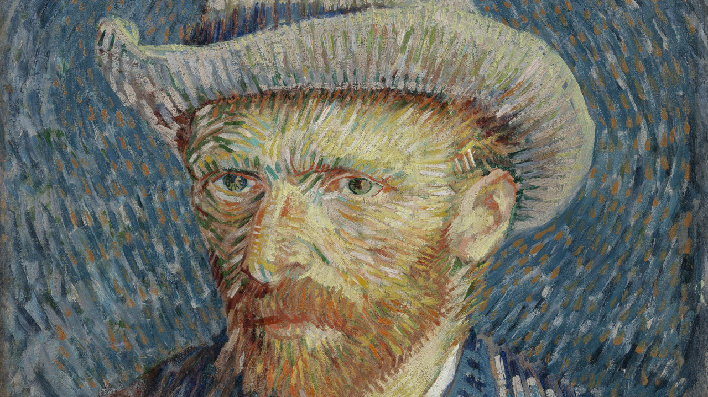
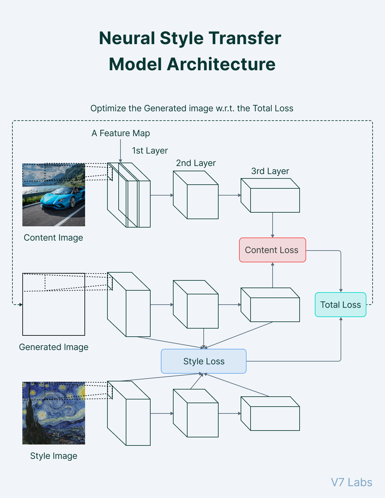

# Loving Vincent

Link to the [YouTube](https://youtu.be/i7fn_svgNXg) video

## Introduction and Inspiration


**Loving Vincent** is a 2017 experimental animated biographical drama film about the life of the painter Vincent van Gogh. It is the first fully painted animated feature film. The film, written and directed by Dorota Kobielaand Hugh Welchman, is a Polish-UK co-production, funded by the Polish Film Institute, and partially through a Kickstarter campaign.

Each of the film's 65,000 frames is an oil painting on canvas, created using the same techniques as Van Gogh by a team of 125 artists drawn from around the globe. It won Best Animated Feature Film Award at the 30th European Film Awards in Berlin and was nominated for Best Animated Feature at the 90th Academy Awards.

A movie production of this kind demands a huge capital and a huge time frame. For an arts student trying to re-create this movie under a student budget, the entire process is an impossible task.

From a financial perspective: 
• Hiring a team of 2000 painters over a 6-year course period accounts to a production cost in millions. 
• A selection round of 5000 painters is again a hefty task

## Explainantion 

The first step of the program involves, the target video file being broken down into an array of images. The array of images is then converted into tensors.



Then, the program employs the use of a Neural Style Transfer Model. With a style image, the array of images is converted into stylised images and then concatanted into 30fps to create a smooth resultant video.

## Processing Time

1. On a M1 Macbook Air, the model takes up 3 minutes to convert a 10 second video clip.
2. On a NVIDIA Pascal Titan X, the model takes upto 30 seconds to convert a 10 second video clip.

## How to run

1. Create a virtual environment
```
$ virtualenv env
$ source env/bin/activate
```
2. Install the required files
```
pip install -r requirements.txt
```
3. Run the main file
```
python main.py
```
4. Enter the video directory, the style image directory and the location where the resultant is to be  stored.


